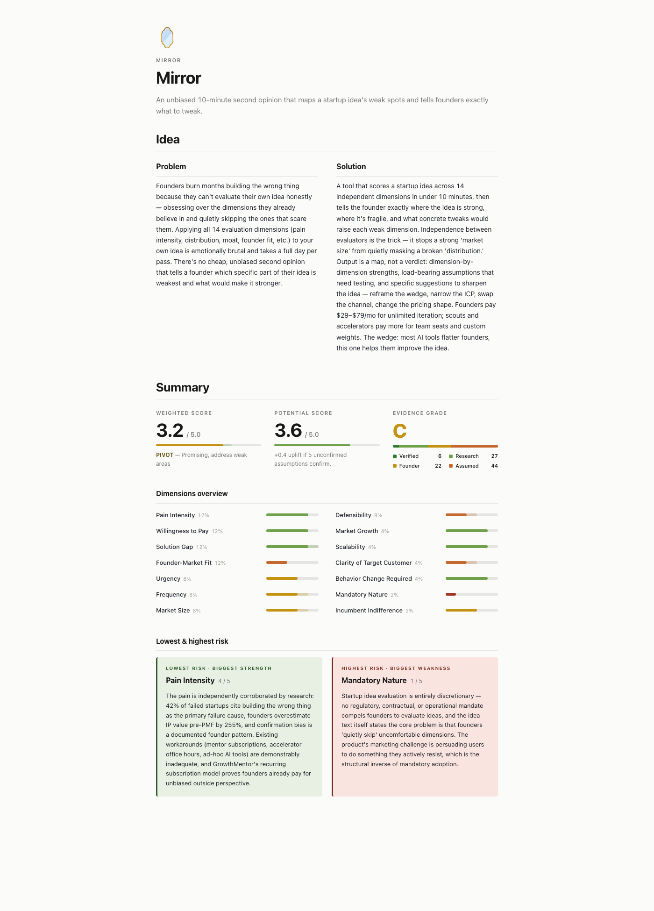

# TweakIdea

[](https://www.npmjs.com/package/tweakidea)
[](https://www.npmjs.com/package/tweakidea)
[](LICENSE)

An independent second opinion on your startup idea. Free, evidence-backed, ready in 10 minutes.

```bash
npx tweakidea
```

**What you get:**

- **A scorecard** — verdict (PIVOT / GO / KILL), weighted score, letter-graded evidence
- **A 14-dimension breakdown** — per-dim scores with what's strong, what's weak, what's untested
- **An assumption ledger** — every untested claim in your idea, surfaced so you know what to validate next
- **A shareable HTML report** — opens in your browser, easy to revisit

**Why not just ask ChatGPT?**

- 14 evaluators run in parallel — one per dimension
- Each runs its own independent targeted web search and cites sources
- Every untested assumption in your idea is surfaced
- Output is a structured beautiful scorecard you can revisit and share, not a one-shot paragraph

Browse full interactive reports: [Airlock](https://ephx.dev/reports/airlock) · [Mirror](https://ephx.dev/reports/mirror) · [Giftwrap](https://ephx.dev/reports/giftwrap)

[](https://ephx.dev/reports/mirror)

## Why I built this

An idea dies from what you don't verify. TweakIdea runs an idea through 14 weighted dimensions — pain intensity, willingness to pay, solution gap, founder-market fit, and ten more — each scored with cited web research. Fourteen Sonnet evaluators work in parallel; Opus merges the results into a scorecard with strengths, weaknesses, and three rewrites targeting the weakest dimensions. The output names what you haven't tested yet. It doesn't tell you to quit your job.

Longer background: [TweakIdea — the origin story](https://ephx.dev/a/tweak-idea) · [TweakIdea v2 — what changed](https://ephx.dev/a/tweak-idea-v2)

## See it work

```
You:    /tweak:evaluate "A mobile app that lets restaurants sell unsold
        food at a discount 30 minutes before closing"

Claude: [researcher kicks off in background — web search on market,
         competitors, pricing]
        [extracts hypotheses from your idea — e.g. "restaurants have
         unsold food at close", "30-min window is enough to sell it"]

        Mark each hypothesis: CONFIRMED / UNCONFIRMED / REJECTED?

You:    [confirms what you already know; leaves the rest unconfirmed]

Claude: [2-4 founder-fit questions on your connection to THIS idea —
         restaurant ops? distribution? capital?]

You:    [answers inline]

Claude: [launches 14 parallel evaluators, one per dimension]
        [each runs its own targeted web searches for evidence]
        [compute.py aggregates per-dim scores, weights them, grades
         evidence A+ through F]
        [Opus synthesizes strengths/weaknesses, next steps, and a
         potential-uplift narrative driven by your unconfirmed
         hypotheses]

        PIVOT — Promising, address weak areas | Weighted 3.4/5.0
        | Potential 4.0/5.0 | Evidence C+
        [14-dim scorecard; report.html opens in browser]

You:    /tweak:improve latest

Claude: [three rewrites — small reframe, medium reshape, big reimagine]
        [each targets the weakest dimensions with rubric-grounded rationale]
        [paste any rewrite into /tweak:evaluate to re-score]
```

## The 14 Dimensions

| Weight | Dimension | What it measures |
|--------|-----------|-----------------|
| 12% | Pain Intensity | Painkiller vs. vitamin vs. candy |
| 12% | Willingness to Pay | Budget exists and buyer is reachable |
| 12% | Solution Gap | Why this hasn't been solved yet |
| 12% | Founder-Market Fit | Founder's domain, network, capabilities |
| 8% | Urgency | Forcing functions and active revenue loss |
| 8% | Frequency | How often the problem occurs |
| 8% | Market Size | TAM/SAM/SOM viability |
| 8% | Defensibility | Moats: network effects, switching costs, data |
| 4% | Market Growth | Sector CAGR trajectory |
| 4% | Scalability | Margins, self-serve, automation potential |
| 4% | Clarity of Target Customer | ICP specificity and findability |
| 4% | Behavior Change Required | Drop-in (5) vs. massive change (1) |
| 2% | Mandatory Nature | Regulatory or contractual forcing |
| 2% | Incumbent Indifference | Risk of being in the kill zone |

## Commands

### `/tweak:evaluate`

Runs 14 independent Sonnet evaluators in parallel — one per dimension — then merges them into a weighted scorecard with assumption tracking and letter-graded evidence. Produces a markdown scorecard and an HTML report.

- `/tweak:evaluate "A mobile app that lets restaurants sell unsold food at a discount"` — inline
- `/tweak:evaluate path/to/idea.md` — from a file
- `/tweak:evaluate` — fully interactive

### `/tweak:browse-hn`

Searches Hacker News via Algolia and prints a ranked table of threads worth feeding into `/tweak:analyze-hn-post`. Each hit is scored 1–5 on how likely it is to yield a real startup-idea seed. Read-only.

- `/tweak:browse-hn llm agents week` — topic `llm agents`, last 7 days
- `/tweak:browse-hn robotics` — topic only; prompts for a time window
- `/tweak:browse-hn today` — window only; browses everything recent
- `/tweak:browse-hn` — fully interactive

### `/tweak:analyze-hn-post`

Fetches a Hacker News post (article + full comment tree), identifies 3-6 technology shifts, and surfaces 1-3 product opportunities per shift. Confirmed opportunities are written up and can be fed into `/tweak:evaluate`.

- `/tweak:analyze-hn-post 43374458` — by HN id
- `/tweak:analyze-hn-post https://news.ycombinator.com/item?id=43374458` — by URL
- `/tweak:analyze-hn-post` — prompts for an id

### `/tweak:improve`

Reads a completed evaluation run and generates three rewrites at escalating scales — Small reframe, Medium reshape, Big reimagine — each targeting the weakest dimensions with rubric-grounded rationale and mandatory trade-off acknowledgments. Read-only.

- `/tweak:improve latest` — improve the most recent run
- `/tweak:improve 20260416` — improve a run by timestamp prefix

### `/tweak:diff`

Compares two evaluation runs side-by-side — score changes, potential shifts, verdict movement, and a per-dimension breakdown of what moved. Read-only.

- `/tweak:diff latest` — compare the two most recent runs
- `/tweak:diff 20260413 20260416` — compare two runs by timestamp prefix
- `/tweak:diff 20260413 latest` — compare a specific run against the latest

### `/tweak:list`

Lists artifacts under `~/.tweakidea/` — evaluation runs, HN analyses, and founder profiles. Arguments are free-form. Read-only.

- `/tweak:list` — all categories, 5 most recent per section
- `/tweak:list runs 20` — the 20 most recent evaluation runs
- `/tweak:list best ideas` — runs ranked by weighted score
- `/tweak:list hn` — just HN analyses

### `/tweak:show`

Opens any artifact under `~/.tweakidea/` by timestamp, keyword, HN id, founder name, or natural query. Run reports open in the browser; HN and founder artifacts are inlined.

- `/tweak:show latest` — most recent evaluation run
- `/tweak:show 20260412-143022` — a specific run by timestamp
- `/tweak:show restaurant food waste` — keyword match on idea text
- `/tweak:show hn 43374458` — an HN analysis by id
- `/tweak:show best ideas` — ranked query over saved runs

### `/tweak:share`

Uploads a run's `report.html` to a secret GitHub gist and prints two links — the gist itself and an `htmlpreview.github.io` rendered URL you can paste into Slack or email. Requires the [GitHub CLI](https://cli.github.com) (`gh auth login`).

- `/tweak:share` — share the most recent run
- `/tweak:share latest` — same, explicit
- `/tweak:share 20260412-143022` — a specific run by timestamp
- `/tweak:share restaurant food waste` — keyword match on idea text

## Prerequisites

> [!IMPORTANT]
> Requires access to both **Claude Sonnet** (14 evaluators + researcher + extractor) and **Claude Opus** (narrative synthesis). Without both, the pipeline won't complete.

- [Claude Code](https://claude.ai/download) installed
- [`uv`](https://docs.astral.sh/uv/) — needed by `/tweak:browse-hn` and `/tweak:analyze-hn-post` for Python script execution. Install: `curl -LsSf https://astral.sh/uv/install.sh | sh` or `brew install uv`

## Installation

```bash
npx tweakidea
```

The installer prompts for global (`~/.claude`) or local (`./.claude`) placement. After install, open Claude Code and type `/tweak:` — you should see `browse-hn`, `diff`, `evaluate`, `improve`, `list`, `share`, `show`, and `analyze-hn-post` in the autocomplete.

> [!NOTE]
> First `/tweak:evaluate` run takes 10-20 minutes — it creates your founder profile, runs the researcher, and dispatches 14 parallel Sonnet evaluators plus one Opus synthesis pass. Subsequent runs reuse the founder profile and finish faster.

<details>
<summary>Uninstall</summary>

```bash
npx tweakidea -u
```

</details>

<details>
<summary>Better article extraction (optional)</summary>

For JS-heavy sites, run `uv run playwright install chromium` once. Without it, the HN fetcher falls back to plain HTTP — which works fine for most sites.

</details>

## License

MIT — see [LICENSE](LICENSE) for details.
